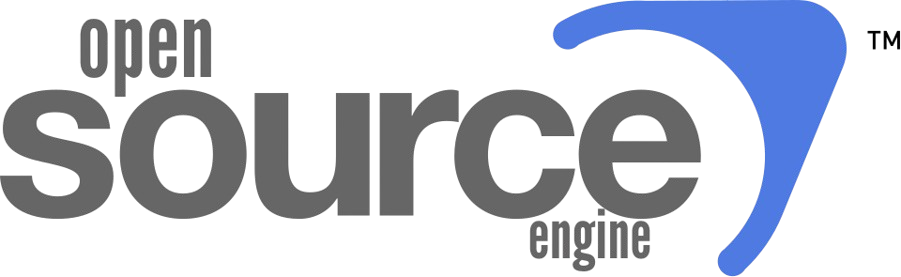

  

## ⚠️ Disclaimer

This project is **NOT affiliated with, endorsed by, or connected to Valve Corporation** in any way.

Any references, inspirations, or naming similarities related to classic FPS games such as
*Counter-Strike* or *Half-Life* are used **purely for educational, experimental, and entertainment purposes**.

**Open Source Engine** is an independent, open-source hobby project created to explore
game engine development, FPS mechanics, and modern rendering techniques.

---

## About

**Open Source Engine** is a lightweight, modular, Rust-based game engine with a strong focus on
**FPS-style games**.

The project aims to recreate the *feel and workflow* of classic FPS engines
(Source-era design philosophy) while keeping the engine modern, minimal, and easy to understand.

This engine prioritizes:
- Gameplay feel over visual excess
- Simplicity over over-engineering
- Learning and experimentation over production complexity

---

## Core Goals

- FPS-first engine design (movement, shooting, networking)
- Modular and extensible architecture
- Modern rendering with minimal overhead
- Open-source and community-friendly development
- Built to be readable, hackable, and modifiable

---

## Example Projects

The repository includes example games built using the engine.
These projects exist to **demonstrate and stress-test the engine**, not to replicate or replace
any commercial titles.

### Counter Strike: Open (CSO)
Competitive multiplayer FPS focused on:
- Player movement
- Gunplay mechanics
- Networking and latency handling

### Half Life Open (HLO)
Story-driven singleplayer / co-op FPS focused on:
- Physics-based interaction
- Scripting and events
- AI and atmosphere

### OpenGarry (OGM)
Sandbox and experimental project focused on:
- Modding
- Rapid prototyping
- Engine flexibility and experimentation

---

## Technology Stack

- **Language:** Rust
- **Rendering:** wgpu (Vulkan / OpenGL backends)
- **Physics:** Rapier3D
- **Scripting:** Lua (planned)
- **Audio:** Spatial audio (planned)
- **Networking:** UDP-based client/server model (planned)

---

## Project Structure

opensource-engine/
├─ engine/ # Core engine code
├─ games/
│ ├─ cso/ # Counter Strike: Open
│ ├─ hlo/ # Half Life Open
│ └─ ogm/ # OpenGarry
├─ tools/ # CLI tools and asset pipeline
└─ docs/ # Documentation

---

## License

This project is licensed under the **MIT License**.

You are free to use, modify, and distribute this engine for both open-source and commercial projects.
See the `LICENSE` file for details.

---

## Final Note

This engine is built for **learning, experimentation, and fun**.

If it runs fast, feels good, and teaches something along the way —
then it’s doing exactly what it was made for.
